# terraform-3-levels-project-structure.

In this project, we will explain how we can structure our terraform project at 3 different levels.

The first level is represented by the folder under V1 structure.

Begin with a small personal project or maybe a startup and gradually evolve it on a large-scale Enterprise Terraform deployment. When you're just getting started, you may create a separate git repository, for example, called Terraform, and start putting all your Terraform files there in the main.tf file. You might initialise the Terraform provider and define components like instance or vpc. For simplicity, let's say you deploy your app using EC2 instances. As time goes by, you'll learn some Terraform naming conventions and decide to refactor. You place the Terraform provider in its own file. You might also be ready to invite some clients to start using your application. At this point, you realise that developing and serving real customers from the same environment is not a good idea. First, you try to make your code more reusable. You refactor a few variables and place them in the variables.tf file, and at this point you would create multiple folders in the root of your repository. You might have folders for development, production, staging, QA, and other production environments in different regions. You would also have a folder for global resources such as IAM users and Docker repositories that should be global to promote your artefacts between different environments. So far, everything looks straight forward as your project continues to grow. You place more infrastructure components in the main or place them as separate files under environment folders. 


No matter which approach you take, all these components will be stored in the same terraform state, and you'll be able to reference these components. For example, by using VPC to pull the VPC ID and use it in different resources. This approach creates an implicit graph with dependencies; therefore, we will first create a VPC, and when it's ready, you will create a subnet with a VPC ID value that is available. 

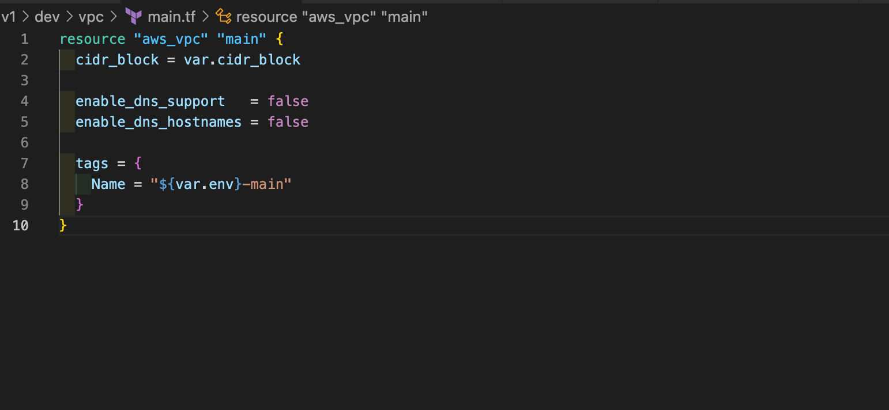

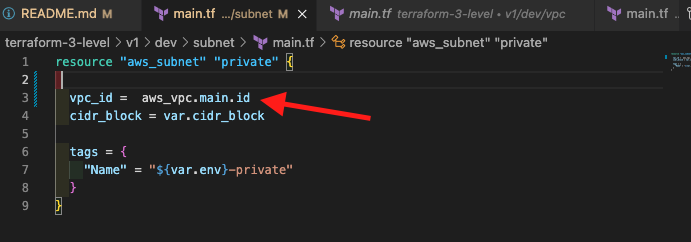

You run the terraform init, plan and apply commands.

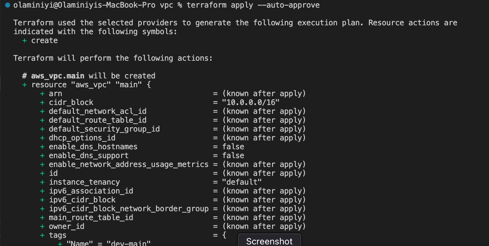

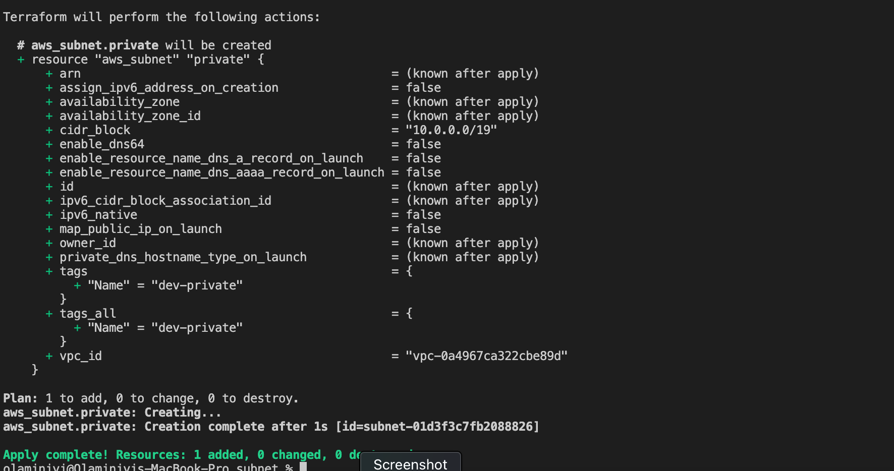

Check your resources

The VPC

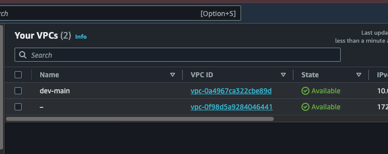

The Subnet 

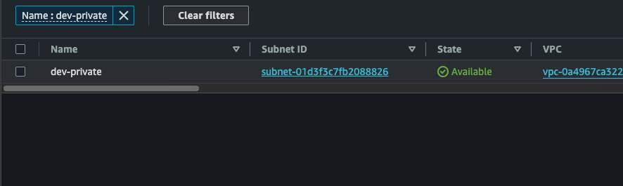


There are a couple of issues with the approach. First, if you have hundreds of terraform resources, it becomes very slow to refresh the state when you run the transform plan. If you are actively working and testing your infrastructure, you might wait a few minutes for Terraform to refresh the state. Adding more resources will make it even slower. The second thing happens to that file, for example, if you accidentally delete or corrupt it by using Terraform remove or import state commands, it becomes a single point of failure. This is not good for large projects. 


We start to create subfolders for each component under each environment. For example, you would have a VPC component, a subnet component, and other resources's components, etc. for the application. This way you split your Terraform state into multiple files. You will expose the VPC ID by creating output in the output.tf file. Inside the subnet folder, you will create data resources that reference the vpc state's file. You can have access to the VPC ID from the VPC's state's file captured in the data resource. With this, the subnet can have access to the VPC ID.

 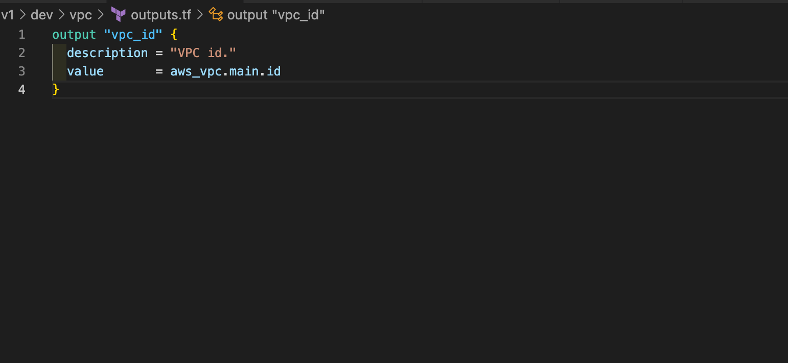

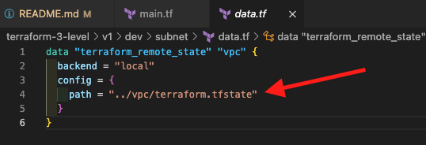

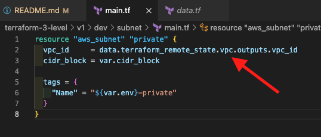


You run the terraform init, plan and apply commands.


Check your resources

The VPC


The Subnet 


The V1 project structure look like this.

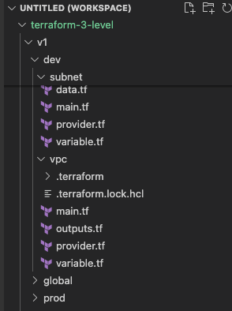

The V2 structure represent the second level organisation.

On a bigger project, when you have enough experience and are already able to group some Terraform resources together and create modules. The next approach is monitorable. In the root, you have environments and module folders. Each environment would have the same components, but now we create modules. For example, you might have a VPC module and a subnet module, etc. At this point, you simply invoke those modules from environment folders. This approach is simple and works well until you change or upgrade a Terraform module since it is just a folder and is a reference in all environments. Any change to the module will trigger updates in all your environments simultaneously, which is not what we want; we want to control upgrades for each environment one at a time. To solve this, you would simply copy and paste the module and give it a new version, then you can update anything in the module when you are ready. You can update their reference to the module in each environment and ensure everything works fine. 

The V2 level structure looks like this:

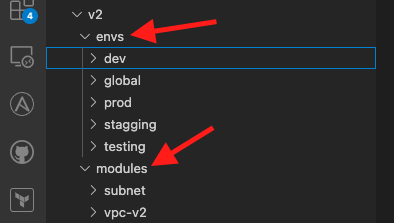

You run the terraform init, plan and apply commands.


Check your resources

The VPC


The Subnet 


The V3 structure represent the third level organisation.

As your team grows, you may decide to start using a more advanced structure. In this case, you create a git repository for each individual Terraform module. However, you need to be careful because having hundreds of modules would mean creating hundreds of git repositories. I suggest trying to create reusable modules that you can apply to different applications to minimise the number of git repositories. Using this approach, you can reference a Terraform module by using a git repository, and when you update the Terraform module, you just create a new version and use the tag in your code. Each version folder will represent a git repository for managing your Terraform project. The biggest advantage of this approach is being able to use git tags and version control from your module. Instead of referencing the local within the module, we will reference the git repository that contains the module.

Create a git repo

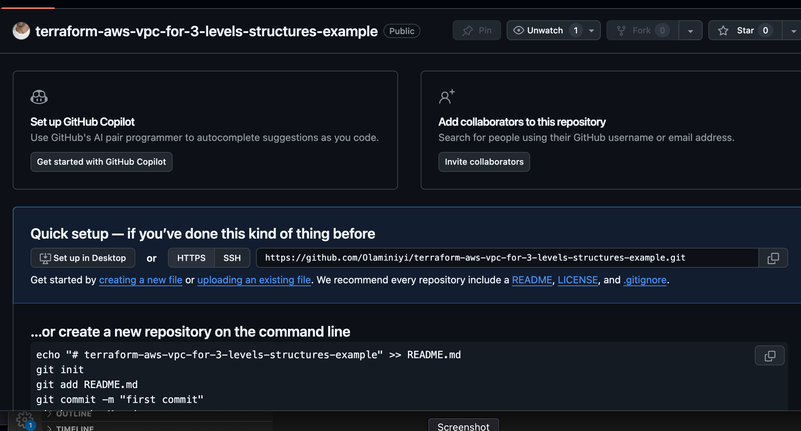

Clone the git repo

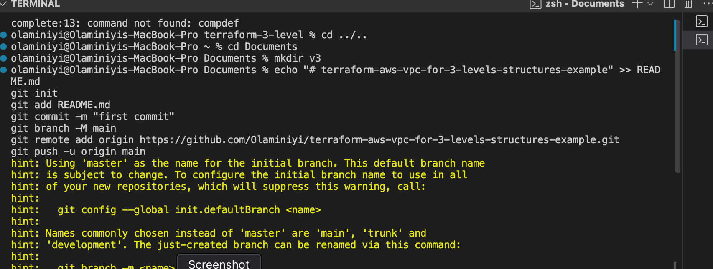

copy the vpc-V2 files under module folder

commit it and push to the repo

> [!NOTE]
> we are adding tag to our commit to represent a version of the infrastructure configuration inside the module. 

This tag we be reference when we want to create our resources.

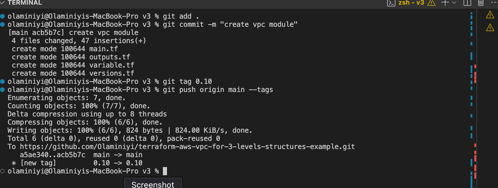

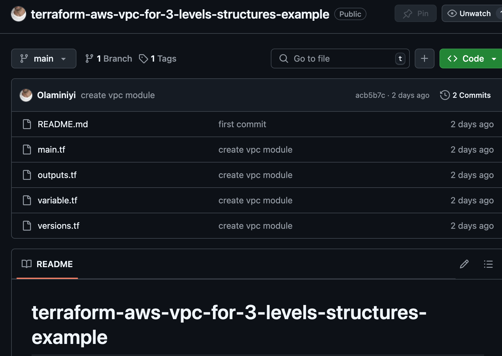

In the v3 folder, to create our vpc, we will reference the git repository that contains the module using the tag to specify the particular version we are using.

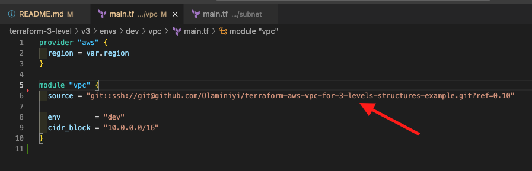

You may need to set up a SSH key for your Github account to get this work. Follow these steps

Generate a new SSH key (if you don't have one):
```
ssh-keygen -t rsa -b 4096 -C "your_email@example.com"
```
Press enter to accept the default location for the key (~/.ssh/id_rsa).

Add the SSH key to your SSH agent:
```
eval "$(ssh-agent -s)"
ssh-add ~/.ssh/id_rsa
```

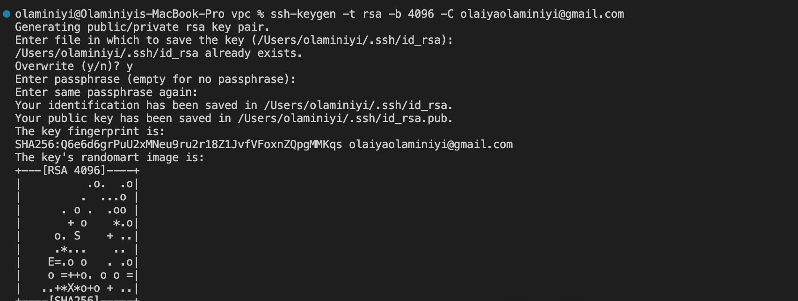


Add your SSH public key to GitHub: 

Go to your GitHub SSH settings and click New SSH Key.


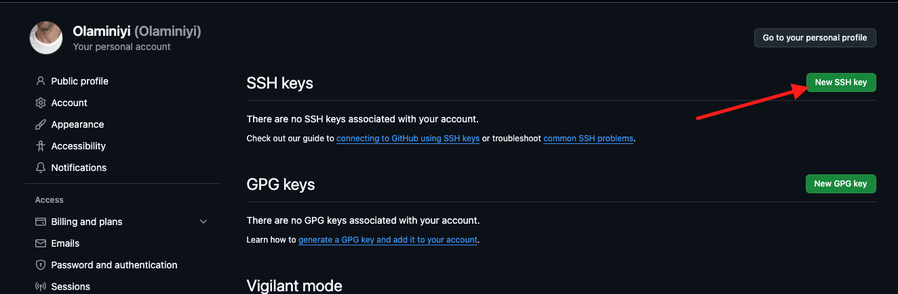

Copy the contents of your public key to your clipboard:

```
cat ~/.ssh/id_rsa.pub
```
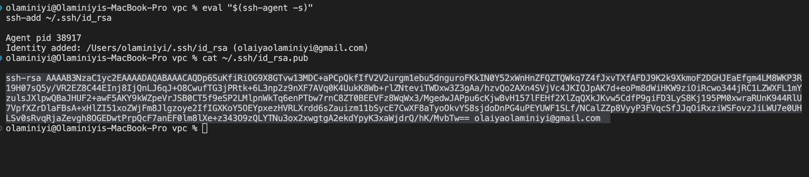

Paste the SSH key and save.

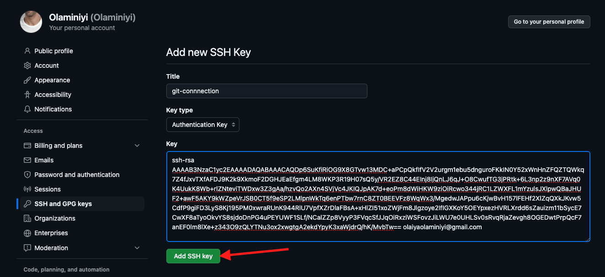

Test if it is working using this command:

```
ssh -T git@github.com
```
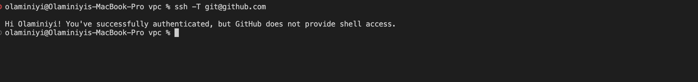

From the V3 folder, inside the VPC folder

You run the terraform init, plan and apply commands.

Check your resources

The VPC


